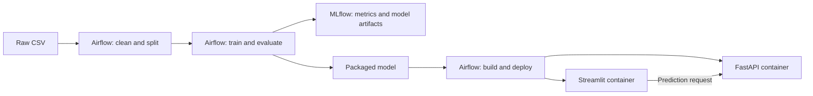

# Water potability prediction

An automated MLOps assignment using the [Kaggle water potability dataset](https://www.kaggle.com/datasets/adityakadiwal/water-potability), Apache Airflow, MLflow, FastAPI, Streamlit, and Docker.

**Start with [RUNNING.md](RUNNING.md)** for the complete setup, commands, verification, troubleshooting, and demonstration instructions. Docker Desktop is the only required local runtime; Python and Airflow run inside Linux containers.



The DAG `water_potability_pipeline` runs every five minutes with one active run at a time. It loads the CSV, imputes missing values with training means, removes training outliers using a 3×IQR rule, and saves stratified train/test files. The holdout retains its outliers so evaluation reflects unseen data. Training compares a random forest using the original nine measurements against a forest with four additional relationship features using identical five-fold stratified CV splits. The candidate with higher mean CV ROC AUC is fitted on all processed training rows, evaluated on the test set, and packaged. MLflow records accuracy, precision, recall, F1, ROC AUC, CV means and standard deviations, parameters, cleaning metadata, and the model.

The added features in `code/features.py` are solids / conductivity, chloramines / organic carbon, trihalomethanes / organic carbon, and observed solids minus solids predicted from conductivity by a linear regression. The regression is fitted independently within each CV training fold and reused to transform its validation fold. These are exploratory measurement relationships rather than chemical laws or treatment-efficiency measurements. Trihalomethanes are converted from micrograms/L to mg/L; organic carbon ppm is treated as mg/L for dilute water. Ratio denominators have a numerical floor of `1e-6`, including at inference, to handle zero inputs.

Scaling is omitted. Imputation and outlier removal remain exclusively in preprocessing; CV uses the already cleaned training CSV, so it compares feature sets conditional on that preprocessing rather than estimating the entire cleaning-and-training procedure. The packaged engineered model computes its relationships automatically, keeping the API's original nine input fields. Its transformer source is archived with the MLflow model and included in the API image.

Comparison on the supplied training data (2026-09-17, five-fold mean ± standard deviation):

| Metric | Original features | Original + four relationships |
| --- | --- | --- |
| Accuracy | 0.6697 ± 0.0177 | 0.6543 ± 0.0108 |
| Precision | 0.6343 ± 0.0343 | 0.6095 ± 0.0281 |
| Recall | 0.3496 ± 0.0559 | 0.3069 ± 0.0427 |
| F1 | 0.4488 ± 0.0504 | 0.4063 ± 0.0375 |
| ROC AUC | 0.6856 ± 0.0290 | 0.6664 ± 0.0306 |

The baseline is selected by mean CV ROC AUC. The added relationships lower all five mean metrics in this comparison; a more interpretable feature does not necessarily improve prediction. These fold summaries do not establish statistical significance. All fold scores are saved in `models/cv_results.json` and logged to MLflow. The selected baseline's test accuracy is 0.6494 and test ROC AUC is 0.6617.

The final DAG task builds the API image containing that run's model, builds the application image, recreates the two serving containers, waits for their health checks, and checks a prediction and the serving MLflow run ID. The web application calls the API over their Docker network.

| Assignment requirement | Implementation |
| --- | --- |
| Load, clean, split, save train/test | `code/download.py`, `code/preprocessing.py` |
| Feature engineering, training, evaluation, packaging | `code/train.py`, `models/model.joblib` |
| Log testing metrics and model | MLflow server, experiment `water-potability` |
| Separate API and application containers | `code/deployment/api`, `code/deployment/app` |
| Scheduled complete pipeline including deployment | `services/airflow/dags/water_potability.py`, `code/deploy.py` |
| Run instructions | [RUNNING.md](RUNNING.md) |

```text
code/
  download.py, preprocessing.py, train.py, features.py, deploy.py, schema.py
  deployment/
    api/                 FastAPI application and Dockerfile
    app/                 Streamlit application and Dockerfile
    docker-compose.yml   Serving containers
data/raw/                Input dataset (generated or supplied locally)
data/processed/          Train/test CSVs and preprocessing metadata
models/                  Model package, metrics, CV comparison, deployment report
notebooks/               Existing exploratory notebook
services/
  airflow/Dockerfile
  airflow/dags/          Scheduled pipeline
  mlflow/Dockerfile
docker-compose.yaml      Airflow, PostgreSQL, and MLflow infrastructure
requirements*.txt        Pinned runtime dependencies
```

Docker runs store data, model packages, logs, and tracking state in persistent named volumes. See the guide to inspect or export them; these are separate from the host's generated files. The existing notebook is preserved.
